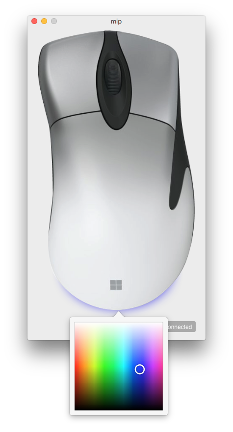

#  mip: Microsoft Intellimouse Pro for Mac, the unofficial companion

    <a href="https://vimeo.com/484594574">Watch Demo</a> — <a href="https://github.com/jeanthom/mip/releases">Download Binaries</a>

    

## Features

 * 100% Objective-C
 * Lots of colors (40000)
 * Tiny! Less than 1MB!
